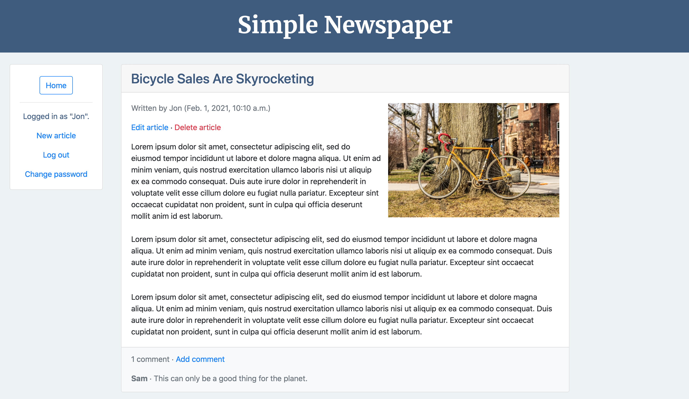

# Newspaper Project

### Overview

A basic newspaper application that displays news articles.

Built following chapters 8-15 of [Django for Beginners](https://djangoforbeginners.com). 

[Live demo](https://jjl-newspaper.herokuapp.com) (hosted on the Heroku free tier so takes a little time to load up)

### Features

Essentially a study project focusing on user authentication and user authorization. 

Includes password reset functionality via email using SendGrid. 

User authorization achieved through the use of mixins to restrict access to logged-in users when creating, updating, or deleting own articles. 

Uses Django's generic class-based views to provide CRUD functionality for handling articles. 

Extended beyond the textbook project by: 
* Separating sensitive information from the codebase
* Adding functionality for uploading images from the front end
* Serving static and image files from an AWS S3 bucket
* Including functionality for adding comments to articles
* Improving the overall front-end styling 

### Built using:

* Python 3.7
* Django 3.0.8
* django-crispy-forms 1.9.2
* Gunicorn 20.0.4
* python-decouple 3.3
* Bootstrap 4
* Visual Studio Code 1.47.3
* macOS 10.14.6
* Heroku
* AWS S3
* SendGrid
* Pipenv

### Screenshots:

List view (logged out):

") 

List view (logged in):

")

Detail view:

