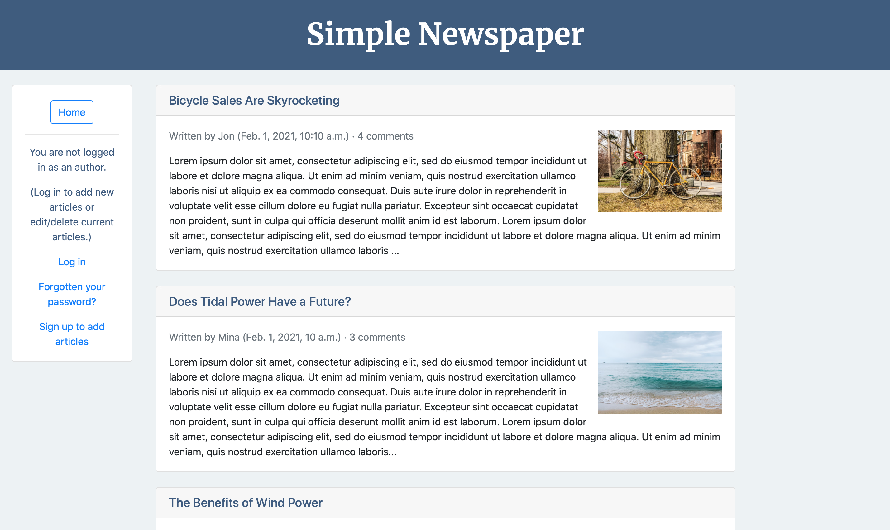
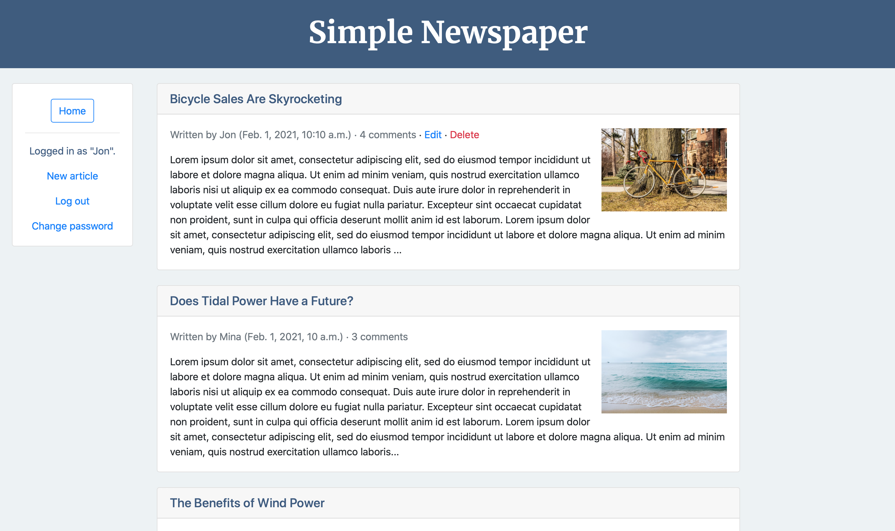

# newspaper_project

### Overview

A basic newspaper application that displays news articles.

Built following chapters 8-15 of [Django for Beginners](https://djangoforbeginners.com). 

[Live demo](https://jjl-newspaper.herokuapp.com) (deployed on Heroku).

### Features

Uses a custom user model that inherits from AbstractUser. 

Includes user authentication with signup, login, and logout functionality. 

Includes password change and password reset functionality via email using SendGrid. 

Uses an Article model for newspaper articles, including an author field that is linked to the custom user model via a foreign key. 

Uses ListView, DetailView, CreateView, UpdateView, and DeleteView from Django's generic class-based views to provide CRUD functionality 
for handling articles. 

Includes user authorization by use of mixins, specifically the LoginRequiredMixin to restrict access to logged-in users when viewing, creating, updating, 
and deleting an article, and the UserPassesTestMixin to further restrict access to article authors when updating or deleting an article. 

Includes basic comment functionality for each article (only through the admin app at this stage) through use of a basic Comment model, which is linked to 
User and Article models via foreign keys. 

Includes separation of sensitive information from the codebase through the use of python-decouple. 

### Built using:

* Python 3.7
* Django 3.0.8
* django-crispy-forms 1.9.2
* Gunicorn 20.0.4
* python-decouple 3.3
* Bootstrap 4
* Visual Studio Code 1.47.3
* macOS 10.14.6
* Heroku

### Screenshot:

